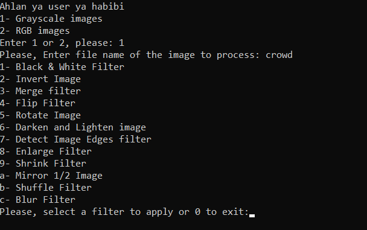

  <h1 style = "text-align:center; font-size:40px; font-weight:bold"> Image Editor </h1>

**Made by:** ***[Mina Albert ](https://github.com/minaalbert33) - [Ziad Ahmed Eliwa](https://github.com/ziadliwa001) - [Seif Mahmoud](https://github.com/seif-hoppas)***

**Supervised by:** Dr: Mohammed El-Ramly in Structured Programming Course (CS112) 3rd Assignment
 
<!-- ABOUT THE PROJECT -->
> ## About The Project
 

* This is a simple Image Processing Console Program
* This is Program enable u to apply 12 different filter to Grayscale and RGB Images.
  
* Designed Using ***bmplib.cpp*** which is a small library in that stores Grayscale images as pixels in 2D arrays and RGB images in 3D array. 
 
 

<!-- NOTES -->
>## Notes

* We provided many Grayscale and RGB images to test the Program in the same directory of the ***main.cpp*** file

* Put your image *(Bitmap image format **.bmp**)* in the same directory of the ***main.cpp*** file an try the filters!

 
> ## Program Overview

 
 

<!-- > ## Examples of the filters:
|  filter 1 | filter 1 | filter 1 | filter 1 |
| ----------- |        ------- | ------------- |  ------------------ |
 | </img>  | </img> | </img> | </img> |
 -->
